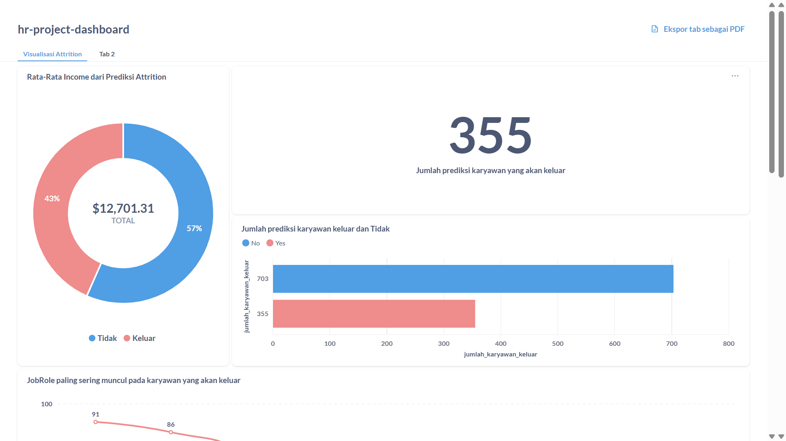
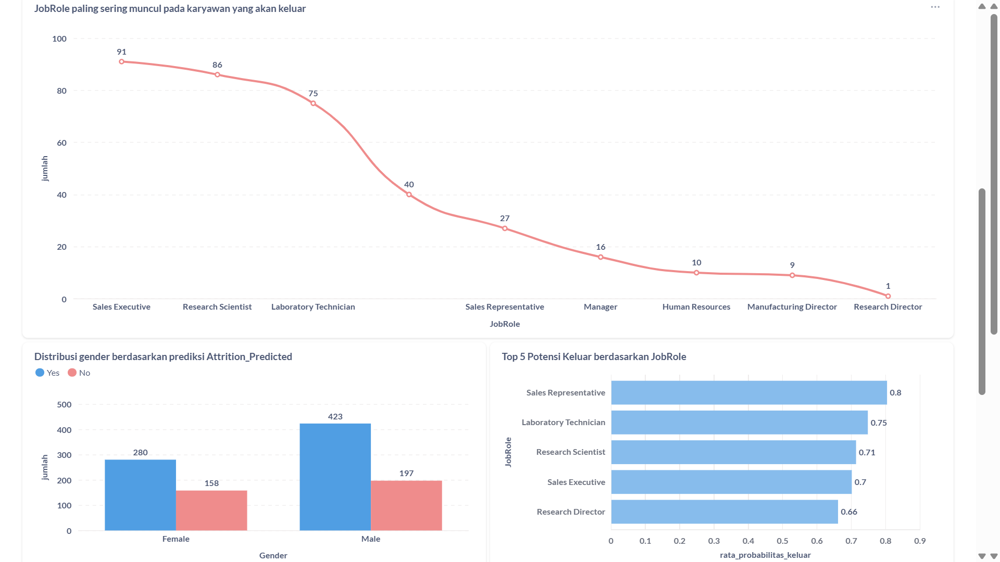
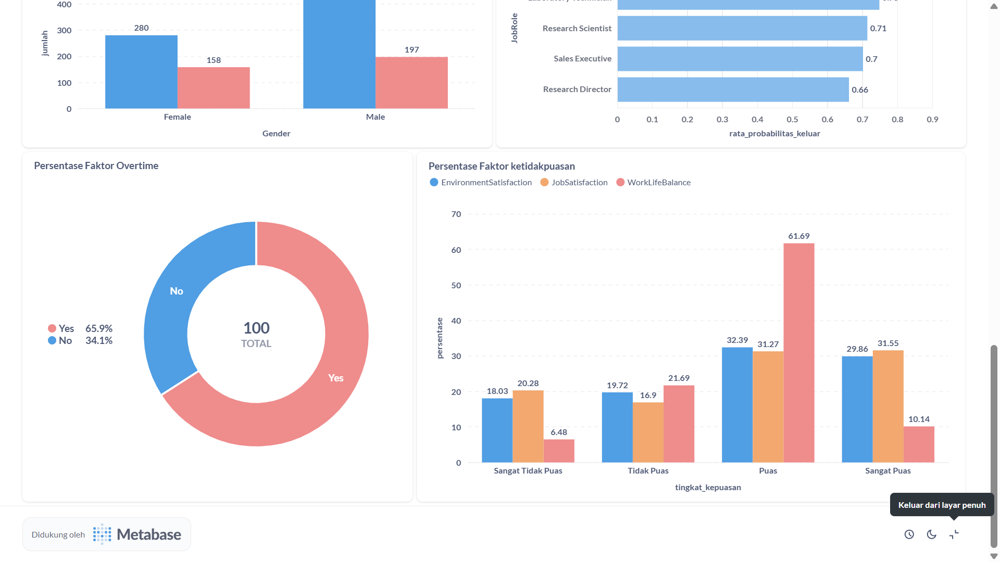
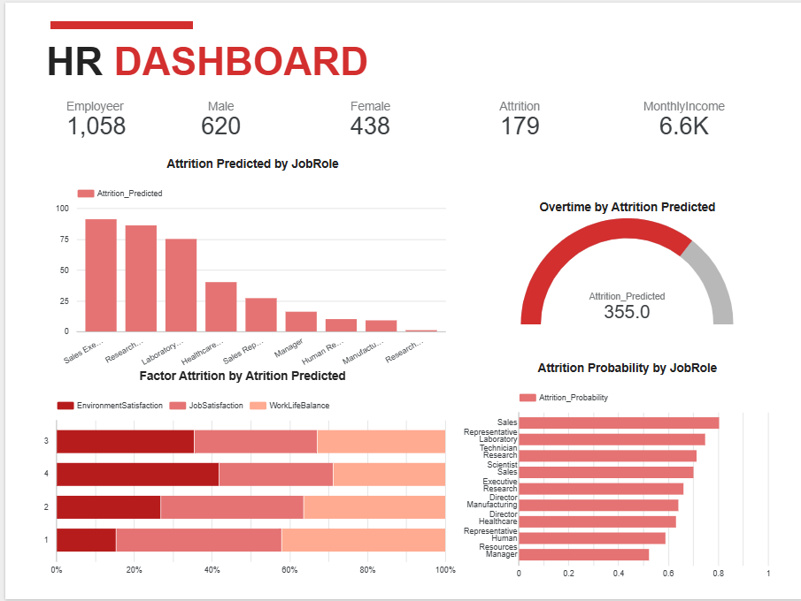

# Proyek Akhir: Menyelesaikan Permasalahan Perusahaan Jaya Jaya Maju

## Business Understanding

Jaya Jaya Maju merupakan salah satu perusahaan multinasional yang telah berdiri sejak tahun 2000. Ia memiliki lebih dari 1000 karyawan yang tersebar di seluruh penjuru negeri.

Walaupun telah menjadi menjadi perusahaan yang cukup besar, Jaya Jaya Maju masih cukup kesulitan dalam mengelola karyawan. Hal ini berimbas tingginya attrition rate (rasio jumlah karyawan yang keluar dengan total karyawan keseluruhan) hingga lebih dari 10%.

### Permasalahan Bisnis
Jaya Jaya Maju, tengah menghadapi tantangan serius dalam manajemen sumber daya manusia, yaitu tingginya tingkat attrition (keluar/mundurnya karyawan) yang telah mencapai lebih dari 10% dari total karyawan aktif.

Masalah ini memiliki urgensi tinggi karena:
- Beban biaya tinggi: Setiap karyawan yang keluar berarti perusahaan harus mengeluarkan biaya tambahan untuk proses rekrutmen dan pelatihan karyawan baru.
- Kehilangan produktivitas: Karyawan baru membutuhkan waktu untuk mencapai tingkat kinerja optimal, yang secara langsung memengaruhi output tim dan proyek.
- Hilangnya pengetahuan organisasi: Karyawan yang keluar sering kali membawa pengetahuan dan pengalaman yang sulit digantikan.
- Pengaruh terhadap moral kerja: Tingginya turnover dapat menurunkan semangat kerja karyawan yang tersisa dan memperburuk iklim organisasi.
- Risiko jangka panjang: Jika tidak segera ditangani, kondisi ini dapat berdampak pada reputasi perusahaan sebagai tempat kerja dan menurunkan daya saing dalam menarik talenta terbaik.

Permasalahan ini menunjukkan bahwa perusahaan membutuhkan pendekatan yang lebih strategis dan berbasis data dalam mengelola risiko attrition.

### Cakupan Proyek
Proyek ini akan berfokus pada analisis sejumlah faktor yang diduga berkontribusi terhadap keputusan karyawan untuk keluar dari perusahaan. Faktor-faktor tersebut mencakup aspek keterlibatan kerja, intensitas perjalanan dinas, jenis jabatan tertentu, status pernikahan, serta kebiasaan lembur. Analisis akan membantu mengidentifikasi kelompok karyawan yang paling berisiko resign dan memberikan pemahaman yang lebih dalam mengenai kondisi-kondisi kerja yang dapat mendorong terjadinya attrition. Diperjelas dengan pembuatan dashboard interaktif.


### Persiapan
| Jenis      | Keterangan                                                                 |
|------------|------------------------------------------------------------------------------|
| Title      | Jaya Jaya Maju                                                   |
| Source     | [github](https://github.com/dicodingacademy/dicoding_dataset/tree/main/employee) |
| Visibility | Public                                                                      |

Setup environment:

### 1. Buat Conda Environment

```bash
conda create -n hr-attrition-env python=3.10 -y
conda activate hr-attrition-env
```

### 2. Install Dependensi

```bash
pip install -r requirements.txt
```
Setup environment docker
### 1. Clone Repository

```bash
git clone https://github.com/Sintasitinuriah/HR-ManagmentAttrition.git
cd HR-ManagementAttrition
```

### 2. Siapkan `docker-compose.yaml`

Pastikan file `docker-compose.yaml` sesuai dengan struktur folder ini.

### 3. Jalankan Docker Compose

```bash
docker-compose up -d
```

### 4. Akses Metabase

Buka browser dan akses:

```
http://localhost:3000
```

### 5. Hentikan Docker

```bash
docker-compose down
```

# Data Understanding
Dataset ini berisi informasi demografis dan metrik terkait pekerjaan dari karyawan, serta flag apakah karyawan tersebut melakukan attrition (keluar dari perusahaan).

| **Kolom**                  | **Deskripsi**                                                                 |
|---------------------------|-------------------------------------------------------------------------------|
| `EmployeeId`              | ID unik untuk masing-masing karyawan                                         |
| `Attrition`               | Apakah karyawan keluar? (0 = Tidak, 1 = Ya)                                   |
| `Age`                     | Usia karyawan                                                                 |
| `BusinessTravel`          | Frekuensi perjalanan dinas                                                    |
| `DailyRate`               | Gaji harian                                                                   |
| `Department`              | Departemen tempat bekerja                                                     |
| `DistanceFromHome`       | Jarak dari rumah ke tempat kerja (dalam km)                                   |
| `Education`               | Pendidikan terakhir (1=Below College, 2=College, 3=Bachelor, 4=Master, 5=Doctor) |
| `EducationField`         | Bidang studi atau pendidikan                                                   |
| `EnvironmentSatisfaction`| Kepuasan terhadap lingkungan kerja (1=Low, 2=Medium, 3=High, 4=Very High)      |
| `Gender`                  | Jenis kelamin karyawan                                                        |
| `HourlyRate`              | Gaji per jam                                                                  |
| `JobInvolvement`          | Tingkat keterlibatan kerja (1=Low, 2=Medium, 3=High, 4=Very High)             |
| `JobLevel`                | Tingkat posisi pekerjaan (1–5)                                                |
| `JobRole`                 | Jabatan atau peran dalam perusahaan                                           |
| `JobSatisfaction`         | Kepuasan terhadap pekerjaan (1=Low, 2=Medium, 3=High, 4=Very High)            |
| `MaritalStatus`           | Status pernikahan                                                             |
| `MonthlyIncome`           | Gaji bulanan                                                                  |
| `MonthlyRate`             | Penghasilan per bulan                                                         |
| `NumCompaniesWorked`      | Jumlah perusahaan yang pernah menjadi tempat kerja                            |
| `Over18`                  | Apakah usia di atas 18 tahun?                                                 |
| `OverTime`                | Apakah sering bekerja lembur?                                                 |
| `PercentSalaryHike`       | Persentase kenaikan gaji tahun lalu                                           |
| `PerformanceRating`       | Penilaian kinerja (1=Low, 2=Good, 3=Excellent, 4=Outstanding)                 |
| `RelationshipSatisfaction`| Kepuasan terhadap hubungan kerja (1=Low, 2=Medium, 3=High, 4=Very High)       |
| `StandardHours`           | Jam kerja standar                                                             |
| `StockOptionLevel`        | Tingkat opsi saham yang dimiliki                                              |
| `TotalWorkingYears`       | Total tahun pengalaman kerja                                                  |
| `TrainingTimesLastYear`   | Jumlah pelatihan yang diikuti tahun lalu                                      |
| `WorkLifeBalance`         | Keseimbangan kerja-hidup (1=Low, 2=Good, 3=Excellent, 4=Outstanding)          |
| `YearsAtCompany`          | Lama bekerja di perusahaan saat ini                                           |
| `YearsInCurrentRole`      | Lama berada di posisi saat ini                                                |
| `YearsSinceLastPromotion` | Lama sejak promosi terakhir                                                   |
| `YearsWithCurrManager`    | Lama bekerja dengan manajer saat ini                                          |

# Data Preparation
## 1. Mengatasi Missing Value
Missing value adalah data yang hilang dalam dataset. Jika tidak ditangani, dapat menyebabkan bias dalam pelatihan model atau bahkan membuat algoritma gagal dijalankan. Menjaga konsistensi dan integritas data dengan mengisi atau menghapus nilai-nilai yang hilang agar model tetap dapat dilatih dengan baik.

## 2. Mengatasi Outliers
Outliers adalah nilai ekstrem yang jauh dari distribusi umum data. Kehadiran outliers dapat mengganggu proses pelatihan model, terutama dalam algoritma yang sensitif terhadap distribusi data. Mengurangi distorsi pada statistik dan model yang dihasilkan, serta meningkatkan stabilitas dan akurasi model.

## 3. Seleksi Fitur (Feature Selection)
Seleksi fitur adalah proses memilih subset dari fitur yang paling relevan terhadap target. Terlalu banyak fitur yang tidak penting dapat menyebabkan overfitting. Meningkatkan performa model, mengurangi waktu pelatihan, dan mencegah kompleksitas berlebih yang dapat menurunkan generalisasi model.

## 4. Standarisasi
Standarisasi adalah proses menyamakan skala dari fitur-fitur numerik. Banyak algoritma machine learning bekerja optimal ketika fitur memiliki skala yang seragam. Meningkatkan kinerja dan konvergensi algoritma yang sensitif terhadap skala, seperti KNN, SVM, dan PCA.

## 5. Splitting Data
Splitting data adalah proses membagi dataset menjadi data pelatihan dan data pengujian. Ini penting untuk mengevaluasi kinerja model secara adil.Untuk memastikan bahwa performa model diuji pada data yang belum pernah dilihat, sehingga mencerminkan kemampuannya dalam generalisasi.

## 6. SMOTE (Synthetic Minority Over-sampling Technique)
SMOTE adalah teknik untuk mengatasi masalah ketidakseimbangan kelas dengan membuat data sintetis dari kelas minoritas melalui interpolasi. Berfungsi untuk meningkatkan kemampuan model dalam mempelajari pola dari kelas minoritas, yang sering kali terabaikan dalam data tidak seimbang.


# Model Development
## Model Random Forest Classifier
**Random Forest** adalah algoritma ensemble learning berbasis decision tree yang menggabungkan prediksi dari banyak pohon untuk meningkatkan akurasi dan stabilitas model. Setiap pohon dalam Random Forest dilatih menggunakan subset acak dari data dan subset acak dari fitur. Pendekatan ini membuat model tahan terhadap overfitting dan sangat cocok untuk dataset dengan dimensi tinggi.

Karakteristik utama Random Forest:
- Menggunakan **bagging (bootstrap aggregating)** untuk membuat pohon-pohon yang berbeda.
- Menggabungkan hasil prediksi semua pohon (melalui voting untuk klasifikasi).
- Cenderung memiliki performa yang baik meskipun terdapat missing values atau data yang tidak terlalu terstandarisasi.
- Relatif tahan terhadap overfitting dibandingkan pohon keputusan tunggal.

## Bayesian Optimatization
**Bayesian Optimization** adalah metode optimasi berbasis probabilistik untuk menemukan nilai terbaik dari fungsi objektif yang mahal untuk dievaluasi. Alih-alih mencoba semua kombinasi (seperti grid search), Bayesian Optimization membangun model surrogate (biasanya Gaussian Process) untuk memperkirakan fungsi objektif dan menggunakan informasi ini untuk memilih titik berikutnya yang paling menjanjikan.

Proses utamanya melibatkan:
- **Model surrogate**: Pendekatan statistik yang memprediksi nilai fungsi objektif untuk kombinasi parameter tertentu.
- **Acquisition function**: Strategi yang digunakan untuk memilih kombinasi parameter berikutnya berdasarkan prediksi dan ketidakpastian.

Keunggulan:
- Efisien dalam jumlah iterasi.
- Cocok untuk optimasi hyperparameter ketika training model memerlukan waktu lama.
- Menghemat waktu dibandingkan dengan grid search atau random search.
----
# Evaluation
## Clasification Report
**Classification Report** adalah ringkasan metrik evaluasi untuk model klasifikasi. Laporan ini memberikan wawasan tentang kinerja model dengan membandingkan label yang diprediksi terhadap label sebenarnya.
Classification Report biasanya mencakup metrik berikut untuk setiap kelas:
- **Precision**
- **Recall**
- **F1-score**
- **Support**

| **Metrik**  | **Deskripsi**                                                                                   |
|-------------|--------------------------------------------------------------------------------------------------|
| **Precision** | Proporsi prediksi positif yang benar-benar benar (True Positive / (True Positive + False Positive)) |
| **Recall**    | Proporsi data positif yang berhasil diprediksi dengan benar (True Positive / (True Positive + False Negative)) |
| **F1-score**  | Rata-rata harmonis dari precision dan recall, berguna saat ingin seimbangkan keduanya          |
| **Support**   | Jumlah kemunculan aktual dari masing-masing kelas dalam data                                   |

**Hasil Classification Report Model Random Forest Classifier** pada model ini adalah sebagai berikut:

                   precision    recall  f1-score   support

         0.0           0.89      0.85      0.87       176
         1.0           0.40      0.47      0.43        36

         accuracy                          0.79       212
         macro avg     0.64      0.66      0.65       212
         weighted avg  0.80      0.79      0.79       212

**Hasil Classification Report Model Random Forest Classifier With Bayesian Optimization** pada model ini adalah sebagai berikut:

                   precision    recall  f1-score   support

         0.0           0.89      0.88      0.88       176
         1.0           0.44      0.47      0.45        36

         accuracy                          0.81       212
         macro avg     0.66      0.67      0.67       212
         weighted avg  0.81      0.81      0.81       212
## Business Dashboard




Untuk mempermudah pemantauan dan analisis risiko attrition secara berkala, telah dibuat sebuah dashboard interaktif menggunakan Metabase. Dashboard ini menyajikan visualisasi data yang intuitif dan informatif mengenai faktor-faktor yang mempengaruhi attrition, seperti:

- Distribusi attrition berdasarkan jabatan (Job Role), Gender, rata-rata income dan frekuensi lembur (Overtime).
- Top 5 Karyawan berpotensi keluar sesuai JobRole berdasarkan Attrition_Probablity. 
- Segmentasi karyawan berdasarkan tingkat risiko attrition.

Dashboard pada gambar di atas hanya dapat diakses di lingkungan lokal proyek saja. sehingga penjelasan dashboard ada pada video sintastnrh-video.mp4

Dashboard alternatif:


Dashboard ini merupakan alternatif dashboard yang dibuat melalui looker studio:

[Link Dashboard – Visualisasi Attrition](https://lookerstudio.google.com/reporting/8166700f-754a-4d09-800d-0f61f3c17e65)

Dashboard ini menjadi alat penting bagi tim HR dalam merancang intervensi yang lebih proaktif dan berbasis data untuk mengurangi tingkat attrition di Jaya Jaya Maju.

## Conclusion
Berdasarkan analisis terhadap data karyawan Jaya Jaya Maju, ditemukan bahwa tingkat attrition yang tinggi (lebih dari 10%) disebabkan oleh sejumlah faktor internal yang dapat diidentifikasi dan ditindaklanjuti. Faktor-faktor yang paling berpengaruh terhadap keputusan karyawan untuk resign antara lain adalah frekuensi lembur, jenis jabatan tertentu, serta tingkat keterlibatan kerja.

Dari hasil analisis, mayoritas karyawan yang meninggalkan perusahaan berasal dari posisi-posisi seperti Sales Executive, Research Scientist, dan Laboratory Technician, yang juga cenderung memiliki tingkat beban kerja dan lembur lebih tinggi. Selain itu, karyawan yang sering melakukan perjalanan dinas dan memiliki jam kerja yang berlebihan menunjukkan risiko resign yang lebih tinggi dibandingkan kelompok lainnya.

Dashboard interaktif yang telah dikembangkan memungkinkan tim HR untuk memonitor kondisi ini secara real-time dan melakukan deteksi dini terhadap karyawan yang berisiko tinggi untuk keluar. Hal ini akan sangat membantu dalam merancang strategi retensi yang lebih tepat sasaran dan efisien.

Secara keseluruhan, proyek ini berhasil memberikan wawasan yang kuat mengenai penyebab utama attrition di perusahaan serta menyediakan alat bantu visualisasi data untuk pengambilan keputusan yang lebih baik ke depannya.

### Rekomendasi Action Items (Optional)
 Beberapa rekomendasi item yang bisa diterapkan oleh perusahaan Jaya Jaya Maju:
 1. Sebanyak 65% karyawan yang sering resign adalah overtime, maka dari itu perusahaan bisa melakukan evaluasi beban kerja dan distribusi jam lembur
 2. Potensi prediksi attrition dibagian JobRole tertinggi adalah Sales Executive, Research Scientist, dan Laboratory Technician, bisa  diakukan survei kepuasan kerja internal atau evaluasi kepemiminan di depatremen tersebut.
 3. Evaluasi faktor Program Keseimbangan Kerja dan Kehidupan (Work-Life Balance): Mengingat tingginya tingkat lembur berhubungan erat dengan attrition, perusahaan bisa menginisiasi program kerja fleksibel, cuti tambahan, atau kebijakan remote working terbatas untuk jabatan tertentu.